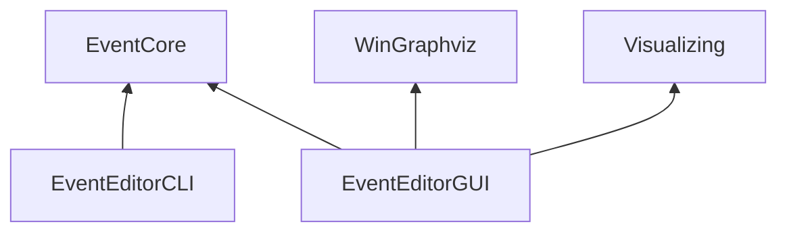

# TW_EventEditor

太吾绘卷事件编辑器

环境需求：

Windows 10

WinGraphviz （安装 WinGraphviz_v1.02.24.msi）

项目依赖关系：

注意事项：

1. Release 模式下 EventEditorGUI 无法生成。

   原因：winGraphviz 仅有 Debug 模式下的 dll
   
2. 使用 x86 模式

   原因：winGraphviz 需求 x86 环境，而 EventEditorGUI 依赖 EventCore，为了EventEditorCore 的一致性，项目统一采用 x86。